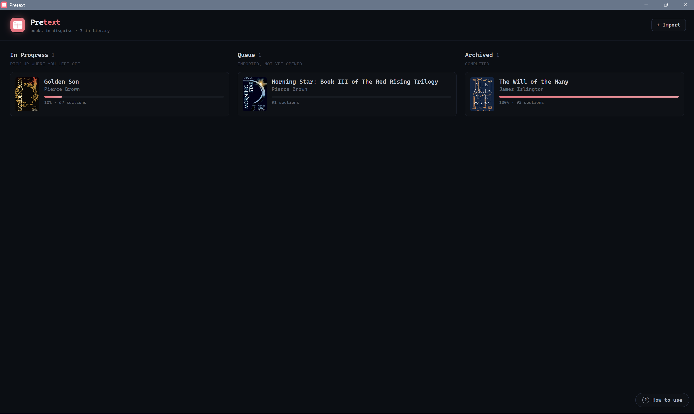
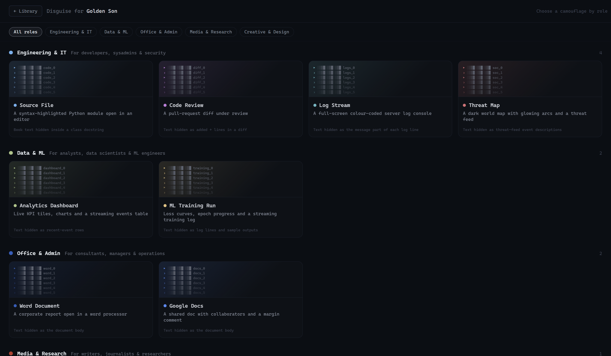
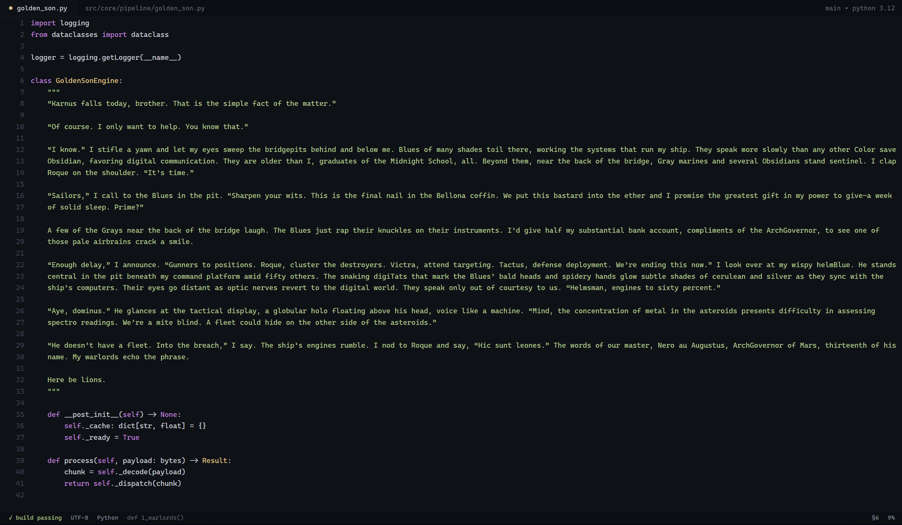
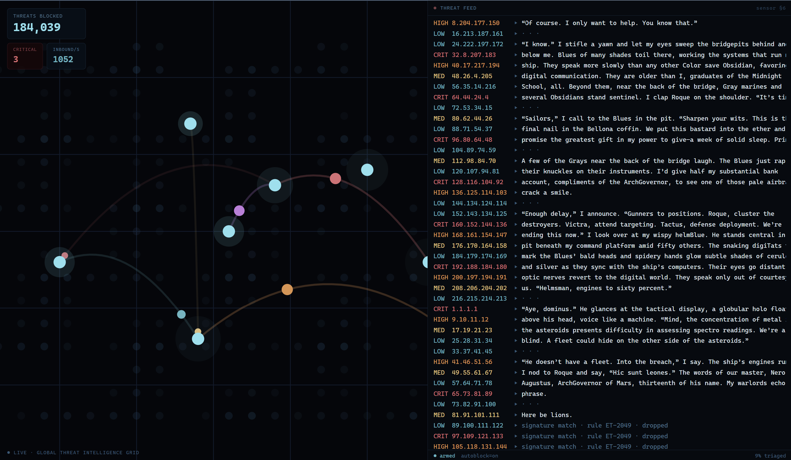
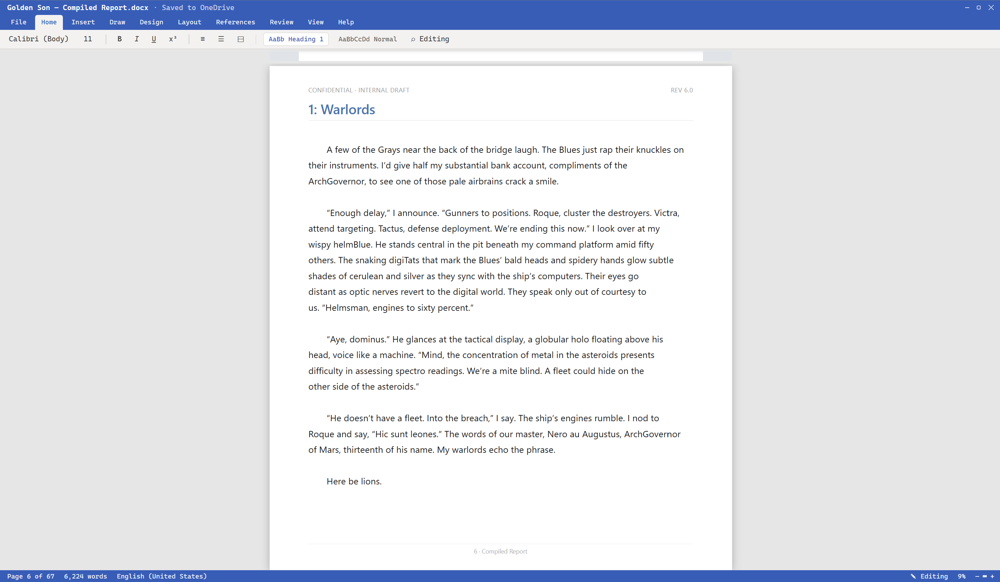
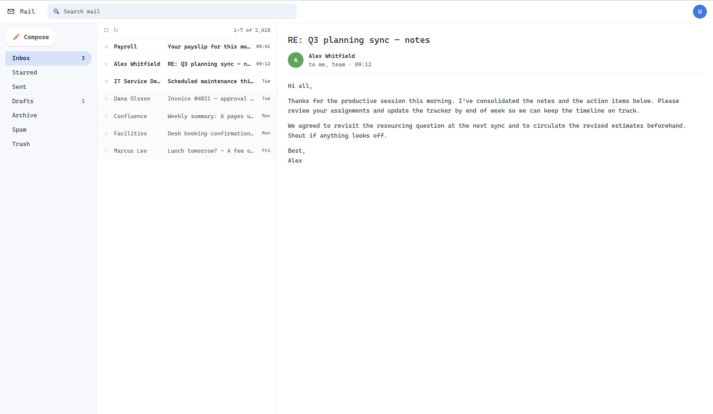

<p align="center">
  
</p>

# Pretext

**Books in disguise.** A desktop EPUB reader that dresses your book up as flashy,
busy-looking technical work — so you can read in plain sight. Pick a book, pick a
**camouflage** (an editor, a dashboard, a log stream, a threat map, a Word doc, a
news site…), and read. One key drops an innocuous cover screen if someone walks by.

## Screenshots

<!-- Drop PNGs into docs/screenshots/ with these names to fill the slots. -->

|  |  |
|:--:|:--:|
|  |  |
| **Library** — your shelves | **Wardrobe** — pick a disguise |
|  |  |
| **Source File** skin | **Threat Map** skin |
|  |  |
| **Word Document** skin | **Panic** cover (Esc / F9) |

## Camouflage wardrobe
Grouped by the kind of job an onlooker might expect:

- **Engineering & IT** — Source File · Code Review · Log Stream · Threat Map
- **Data & ML** — Analytics Dashboard · ML Training Run
- **Office & Admin** — Word Document · Google Docs
- **Media & Research** — News Site
- **Creative & Design** — Design Canvas

Every skin hides the book text on a readable surface and animates on a timer, so
the screen always looks busy. Your reading position is saved per book and survives
window resizes and text-size changes.

## Install
Grab the latest `pretext-x.y.z-setup.exe` from the [Releases](../../releases) page
and run it. (Unsigned, so Windows SmartScreen may warn on first run — *More info →
Run anyway*.)

## Stack
Electron + React + TypeScript (electron-vite), Tailwind, ECharts, Framer Motion.

## Develop
```bash
npm install
npm run dev        # hot-reloading app
npm run build      # typecheck + bundle
npm run build:win  # package the .exe
```
Drop any `.epub` in the project root and it's auto-imported in dev.

## Reader controls
`←/→` or click — turn pages · `c` — contents & text size · `−/=` — text size ·
`Backspace` / hover `←` — exit book · `Esc` or global `F9` — panic cover.

Brand colour `#FF6C7F`. Icon/branding sources live in `icons/`.
